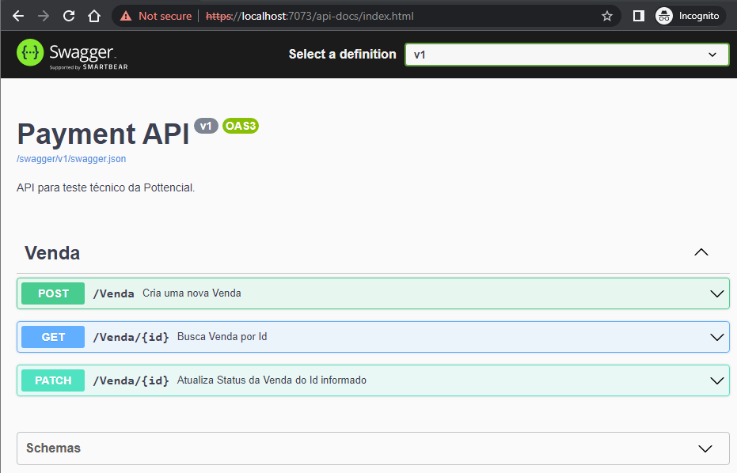
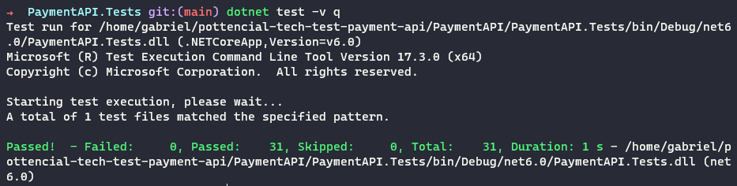

# Pottencial - Tech Test - Payment API
### Rota api-docs (Swagger UI)


### Testes (NUnit)

## Sobre
Projeto de API REST para a realização de teste técnico.

Criado com **C#**, **.NET 6** e **Entity Framework Core** e testado com **NUnit**.

## Tarefas e Requisitos [➡️](docs/TAREFAS_E_REQUISITOS.md)

## Instalação
### Prerequisitos
- **.NET 6**

### Como instalar
No seu terminal, clonar o repositório.
```
git clone git@gitlab.com:gccunha015-dio/pottencial-tech-test-payment-api.git
```

Entrar no diretório da solução.
```
cd pottencial-tech-test-payment-api/PaymentAPI
```

Instalar dependências.
```
dotnet restore
```

## Utilização
Entrar no diretório da API.
```
cd PaymentAPI
```

Rodar a aplicação.
```
dotnet run
```

Em seu navegador, acessar a página:
```
https://localhost:7073/api-docs
```


## Como rodar os Testes
Entrar no diretório de testes.
```
cd PaymentAPI.Tests
```

Rodar os testes.
```
dotnet test
```
